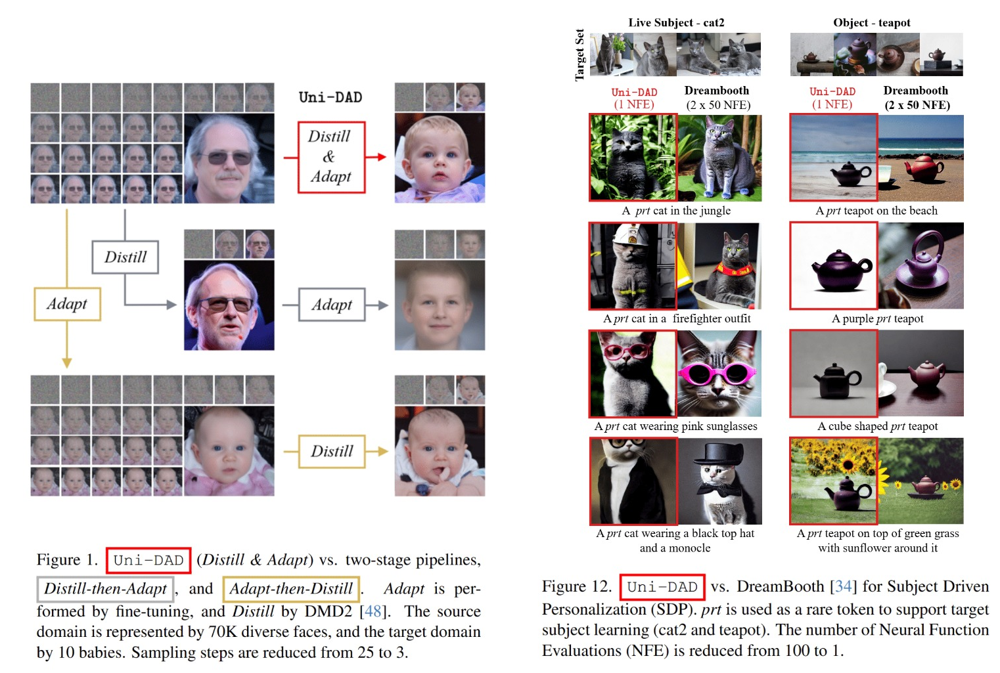

#  `Uni-DAD`: Unified Distillation and Adaptation of Diffusion Models for Few-step Few-shot Image Generation

> **Uni-DAD: Unified Distillation and Adaptation of Diffusion Models for Few-step Few-shot Image Generation**,            
> Yara Bahram, Melodie Desbos, Mohammadhadi Shateri, Eric Granger   
> *CVPR 2026 ([arXiv 2508.05685](https://arxiv.org/pdf/2511.18281))*  

Diffusion models are usually adapted for new domains and distilled for faster sampling in two separate stages. We ask: why not do both at once? `Uni-DAD` jointly adapts and distills in a single training pipeline, enabling fast generation on new domains without the design complexity and quality-diversity trade-offs of Distill→Adapt or Adapt→Distill.


<!-- 
🪧 [Poster](https://github.com/yaramohamadi/DogFit/blob/master/DogFit_AAAI26_Poster.pdf)
▶️ [Video](https://www.youtube.com/watch?v=N5TexhceXbY)
📑 [Slides](https://github.com/yaramohamadi/DogFit/blob/master/DogFit_AAAI26_Slides.pdf)
This is a comment. -->

### 📌 CVPR 2026

Stay tuned for Poster, Video, and Slides...

## Abstract

Diffusion models (DMs) produce high-quality images, yet their sampling remains costly when adapted to new domains. Distilled DMs are faster but typically remain confined within their teacher’s domain. Thus, fast and high-quality generation for novel domains relies on two-stage pipelines: Adapt-then-Distill or Distill-then-Adapt. However, both add design complexity and often degrade quality or diversity.
We introduce `Uni-DAD`, a single-stage pipeline that unifies DM distillation and adaptation. It couples two training signals: (i) a dual-domain distribution-matching distillation (DMD) objective that guides the student toward the distributions of the source teacher and a target teacher, and (ii) a multi-head generative adversarial network (GAN) loss that encourages target realism across multiple feature scales. The source domain distillation preserves diverse source knowledge, while the multi-head GAN stabilizes training and reduces overfitting, especially in few-shot regimes. The inclusion of a target teacher facilitates adaptation to more structurally distant domains.
We evaluate `Uni-DAD` on two comprehensive benchmarks for few-shot image generation (FSIG) and subject-driven personalization (SDP) using different diffusion backbones. It delivers better or comparable quality to state-of-the-art (SoTA) adaptation methods even with ≤4 sampling steps, and often surpasses two-stage pipelines in both quality and diversity.


<div align="center">
  
</div>

## News

- 📅 **2026-03-17** — Updated the **arXiv** version with new SDP results. Check it out on [arXiv 2508.05685](https://arxiv.org/pdf/2511.18281)!
- 🚀 **2026-03-17** — Created this **GitHub** repository and uploaded the first version of the FSIG code.
- ⚠️ **2026-03-17** — The current codebase is an initial release and has not yet been fully tested.
- 🚀 **2026-03-23** — Uploaded the first version of the SDP code.
- 🔜 **Coming soon** — Trained weights.

## Table of Contents

- [Abstract](#abstract)
- [Few-shot Image Generation with Guided-DDPM](#few-shot-image-generation-with-guided-ddpm)
  - [Structure](#structure)
  - [Environment](#environment)
  - [Weights](#weights)
  - [Data](#data)
  - [Config](#config)
  - [Weights & Biases (W&B) Logging](#weights--biases-wb-logging)
  - [1) Train and Streaming Test in Parallel (Recommended)](#1-train-and-streaming-test-in-parallel-recommended)
  - [2) Train Only](#2-train-only)
  - [3) Test Only](#3-test-only)
- [Subject-driven Personalization with SDv1.5](#subject-driven-personalization-with-sdv15)
  - [SDP Structure](#structure-1)
  - [SDP Environment](#environment-1)
  - [SDP Weights](#weights-1)
  - [SDP Data](#data-1)
  - [SDP Config](#config-1)
  - [1) SDP Train and Streaming Test in Parallel (Recommended)](#1-sdp-train-and-streaming-test-in-parallel-recommended)
  - [2) SDP Train Only](#2-sdp-train-only)
  - [3) SDP Test Only](#3-sdp-test-only)
- [Contact](#contact)
- [Citation](#citation)
- [Acknowledgments](#acknowledgments)


## Structure

```
.
├── 1_FSIG/
│   ├── checkpoints/                   # Pretrained .pt models (e.g., ffhq.pt)
│   ├── checkpoint_path/               # Training outputs (logs, ckpts, wandb, etc.)
│   ├── datasets/                      # Datasets root
│   │   ├── fid_npz/                   # Held-out FID stats (.npz files)
│   │   └── targets/                   # Few-shot raw folders and LMDB datasets
│   ├── dnnlib/                        # FSIG utility dependency
│   ├── main/
│   │   ├── data/                      # LMDB and dataset utilities
│   │   └── dhariwal/
│   │       ├── train_dhariwal.py      # Main training script (Uni-DAD / DMD2-style training)
│   │       ├── test_dhariwal.py       # Evaluation / sampling script
│   │       ├── dhariwal_unified_model.py
│   │       ├── dhariwal_guidance.py
│   │       ├── dhariwal_network.py
│   │       └── evaluation_util.py     # FID, LPIPS, PRDC, few-shot dataset helpers
│   ├── torch_utils/                   # FSIG training utilities
│   ├── util_scripts/                  # Helper scripts (LMDB creation, FID stats, resize, env setup)
│   └── experiments/
│       ├── train.sh                   # Entry point for training. Also called by train_test_stream.sh
│       ├── train_test_stream.sh       # Entry point for training with streaming parallel evaluation (Recommended)
│       └── test.sh                    # Entry point for testing and evaluation
├── 2_SDP/
│   ├── checkpoints/                   # SDP checkpoints
│   ├── data/                          # Dataset roots
│   ├── main/
│   │   ├── models/                    # Multihead GAN, guidance, U-Net, unified model
│   │   ├── pipeline/
│   │   │   ├── train_sd.py            # Main training launcher
│   │   │   └── paused_generation.py   # Generation helper
│   │   └── prepare_data/
│   │       └── README.md              # Dataset creation instructions
│   ├── evaluation/
│   │   ├── run_eval.sh                # Evaluation launcher
│   │   ├── build_manifest.py          # Evaluation manifest builder
│   │   ├── evaluation.py              # Evaluation entry point
│   │   └── run_metrics.py             # CLIP-I, CLIP-T, and DINO metrics
│   ├── scripts/
│   │   ├── train.sh                   # Entry point for training. Also called by train_test_stream.sh
│   │   ├── train_test_stream.sh       # Entry point for training with streaming parallel evaluation (Recommended)
│   │   └── test.sh                    # Entry point for testing and evaluation
│   └── setup.sh                       # Create uni_dad_sdp environment
├── 3_Docs/                            # Teaser and README assets
├── third_party/
│   └── dhariwal/                      # Vendored guided-diffusion dependency for FSIG
└── README.md
```

## Few-shot Image Generation with Guided-DDPM

### Environment

#### FSIG Environment
This application was tested with the following setup:

- Python 3.10.13
- PyTorch 2.0.1
- TorchVision 0.15.2
- CUDA 11.8 (`cu118`)

All additional Python dependencies are listed in `1_FSIG/requirements.txt`.

To create the environment locally with conda, run:

```bash
bash 1_FSIG/util_scripts/setup_env.sh
conda activate unidad
```

This script installs all required packages and sets up the environment. If you do not use ```conda```, you can adapt the commands inside ```setup_env.sh``` to your own environment manager.

#### SDP Environment

This application was tested with the following setup:

- Python 3.8.20
- PyTorch 2.0.1
- TorchVision 0.15.2
- CUDA 11.7 (`cu11`)

All Python dependencies are listed in `sdp_environment.yml`.

To create the environment locally with conda or venv, run:

```bash
bash 2_SDP/setup.sh
conda activate "$ENV_NAME" 
# or
source venv/bin/activate
```
This script installs all required packages and sets up the environment.

### Weights

#### FSIG - Unconditional Generation
To use our trained models for generating images, download [Babies weights]() and [Sunglasses weights](). To train your own model, first download the [guided-DDPM weights trained on FFHQ 256×256](https://github.com/yandex-research/ddpm-segmentation) and save it as `1_FSIG/checkpoints/ffhq.pt`. The checkpoint file needs to be pointed to by ```--model_id``` or ```CHECKPOINT_INIT``` in your config or bash scripts.
#### SDP - Conditional Generation (Subject Driven Perosnalization)
To use one of our trained models for generating images, download [cat2 weights]() or [teapot weights](). To train your own model, first download the [SDv1.5 weigths trained on LAION 5+](https://huggingface.co/tianweiy/DMD2/tree/main/model/sdv1.5/laion6.25_sd_baseline_8node_guidance1.75_lr5e-7_seed10_dfake10_diffusion1000_gan1e-3_resume_fid8.35_checkpoint_model_041000).

### Data 

#### FSIG - Unconditional Generation
The provided 10-shot target datasets are available in `1_FSIG/datasets/targets/` in both raw and LMDB formats. To use your own target set, first resize your images to 256×256 with `1_FSIG/util_scripts/resize_dataset.py`. Then arrange them following the same structure as the provided examples (e.g., `1_FSIG/datasets/targets/10_babies/0/`) and include a `dataset.json` file listing the images. Finally, convert the raw images into LMDB format with `1_FSIG/util_scripts/create_fewshot_lmdb.py` (adapt the script arguments / paths inside as needed).

For FID evaluation, download the full [Babies](https://drive.google.com/file/d/1xBpBRmPRoVXsWerv_zx4kQ4nDQUOsqu_/view), [Sunglasses](https://drive.google.com/file/d/1Uu5y_y8Rjxbj2VEzvT3aBHyn4pltFgyX/view), [MetFaces](https://github.com/NVlabs/metfaces-dataset), and [AFHQ-Cat](https://drive.google.com/file/d/1_-cDkzqz3LlotXSYMBXZLterSQe4fR7S/view) datasets. Resize them to 256×256 with `1_FSIG/util_scripts/resize_dataset.py`, then convert them into `.npz` files with `1_FSIG/util_scripts/generate_fid_npz.py`. Save the outputs in `1_FSIG/datasets/fid_npz/` as `babies.npz`, `cat.npz`, `metfaces.npz`, and `sunglasses.npz`. 

#### SDP - Conditional Generation (Subject Driven Perosnalization)

The provided 5/6-shot target dataset from Dreambooth are available in `2_SDP/data/instances.lmdb/` in LMDB format. To use your own target set, first resize your images to 521x521 with `1_FSIG/util_scripts/resize_dataset.py`. Then arrange them following the same structure as the provided examples (e.g., `2_SDP/data/instance_images/cat2/`). Finally, convert the raw images into LMDB format following the instructions in `2_SDP/main/prepare_data/`.

### Config

For FSIG, default configurations are defined in ```1_FSIG/experiments/defaults.sh```.
For SDP, you can find them in ```2_SDP/scripts/train_test_stream.sh```.

### Weights & Biases (W&B) Logging

This codebase uses Weights & Biases for experiment tracking. First, log in to W&B using ```wandb login```. Then, set your W&B environment variables by running the following lines in your environment:

```
export WANDB_ENTITY="ENTER_YOUR_WANDB_ENTITY"
export WANDB_PROJECT="ENTER_YOUR_WANDB_PROJECT"
export WANDB_API_KEY="ENTER_YOUR_WANDB_API_KEY"
```

Runs will then be automatically logged to your W&B project and mirrored under `1_FSIG/checkpoint_path/<EXPERIMENT_NAME>/wandb/`.


### 1) Train and Streaming Test in Parallel (Recommended)

To train the model while evaluating it online, use:

```
bash 1_FSIG/experiments/train_test_stream.sh
```


This setup logs both training and test metrics to W&B throughout training. We recommend that you use separate GPUs for train and test streams. For this, for example set `TRAIN_GPUS=0` and `TEST_GPUS=1`. Multi-GPU training is also supported, e.g., `TRAIN_GPUS=0,1`; In that case, make sure `NPROC_PER_NODE` and `NNODES` are set correctly. The examples in the next sections can also be adapted to run `train_test_stream.sh`.

### 2) Train Only

To run training without online evaluation, use:
 
```
bash 1_FSIG/experiments/train.sh
```
$CHECKPOINT_PATH 
For example, the following command trains `Uni-DAD` on the 10-shot Babies target set without a target teacher, and saves checkpoints and W&B logs to `1_FSIG/checkpoint_path/babies_train`:
```
# run name and output paths
WANDB_NAME=babies_train \
EXPERIMENT_NAME=babies_train \
OUTPUT_PATH=1_FSIG/checkpoint_path/babies_train \

# source model initial weight 
CHECKPOINT_INIT=1_FSIG/checkpoints/ffhq.pt \

# dataset
DATASET_NAME=babies \
DATASET_SIZE=10 \

# training setup
TRAIN_GPUS=0 \
NPROC_PER_NODE=1 \
NNODES=1 \
SEED=10 \
BATCH_SIZE=1 \
GRAD_ACCUM_STEPS=1 \
TRAIN_ITERS=40000 \
NUM_DENOISING_STEP=3 \

# source-only teacher configuration
DMD_SOURCE_WEIGHT=1.0 \
USE_SOURCE_TEACHER=1.0 \
DMD_TARGET_WEIGHT=0.0 \
USE_TARGET_TEACHER=0.0 \
TRAIN_TARGET_TEACHER=0.0 \

# GAN
GAN_ADV_LOSS=bce \
GAN_MULTIHEAD=--gan_multihead \

bash 1_FSIG/experiments/train.sh
```

To simulate a larger batch size, you can increase `GRAD_ACCUM_STEPS`, e.g., `GRAD_ACCUM_STEPS=4`. To adjust logging, checkpointing, and W&B logging frequency, use `LOG_ITERS, WANDB_ITERS, and MAX_CHECKPOINT`.

The following example resumes training from an intermediate checkpoint on the 10-shot MetFaces target set with a target teacher, using the dual-DMD weighting factor `a=0.75`:

```
# run name and output path
WANDB_NAME=metfaces_train \
EXPERIMENT_NAME=metfaces_train \
OUTPUT_PATH=1_FSIG/checkpoint_path/metfaces_train \

# checkpoint to resume training from
CHECKPOINT_PATH=1_FSIG/checkpoint_path/metfaces_train \

# dataset
DATASET_NAME=metfaces \
DATASET_SIZE=10 \

# source-only teacher configuration
DMD_SOURCE_WEIGHT=0.25 \
USE_SOURCE_TEACHER=1.0 \
DMD_TARGET_WEIGHT=0.75 \
USE_TARGET_TEACHER=1.0 \
TRAIN_TARGET_TEACHER=1.0 \

...
```

It is further possible to use a pre-trained frozen target teacher during `Uni-DAD` training. In that case, set `USE_TARGET_TEACHER=1.0`, `TRAIN_TARGET_TEACHER=0`, and provide the checkpoint path through `TARGET_TEACHER_CHECKPOINT_PATH=...`.

### 3) Test Only

To generate samples and evaluate a trained model, use:

```
bash 1_FSIG/experiments/test.sh
```

To use our trained models for generating images, download [Babies weights]() and [Sunglasses weights](). The code for FID, Intra-LPIPS, and precision/recall (PRDC) computations is provided under `1_FSIG/main/dhariwal/evaluation_util.py`.

During training, the best performing checkpoint is saved under ... . The following example generates 5000 samples from the best checkpoint folder and evaluates a trained student on the 10-shot Babies target set using FID and Intra-LPIPS:

```
# logging names
WANDB_NAME=babies_best_once \
EXPERIMENT_NAME=babies_train \

# target dataset
DATASET_NAME=babies \
DATASET_SIZE=10 \
CATEGORY=babies \

# path to the folder containing the saved checkpoints
OUTPUT_PATH=1_FSIG/checkpoint_path/babies_train \

# evaluation data
FID_NPZ_ROOT=1_FSIG/datasets/fid_npz \
FEWSHOT_DATASET=1_FSIG/datasets/targets/10_babies/0 \

# testing setup
TEST_GPUS=0 \
TOTAL_EVAL_SAMPLES=5000 \
NUM_DENOISING_STEP=3 \
EVAL_BEST_ONCE=--eval_best_once \

bash 1_FSIG/experiments/test.sh
```


## Subject-driven Personalization with SDv1.5 

### Environment

This application was tested with the following setup:

- Python 3.8.20
- PyTorch 2.0.1
- TorchVision 0.15.2
- CUDA 11.7 (`cu11`)

All Python dependencies are listed in `sdp_environment.yml`.

To create the environment locally with conda or venv, run:

```bash
bash 2_SDP/setup.sh
conda activate "$ENV_NAME" 
# or
source venv/bin/activate
```
This script installs all required packages and sets up the environment.

### Weights
To use one of our trained models for generating images, download [cat2 weights]() or [teapot weights](). To train your own model, first download the [SDv1.5 weigths trained on LAION 5+](https://huggingface.co/tianweiy/DMD2/tree/main/model/sdv1.5/laion6.25_sd_baseline_8node_guidance1.75_lr5e-7_seed10_dfake10_diffusion1000_gan1e-3_resume_fid8.35_checkpoint_model_041000).

### Data 
The provided 5/6-shot target dataset from Dreambooth can be created following the README instructions in `2_SDP/main/prepare_data/`. To use your own target set, first resize your images to 521x521 with `1_FSIG/util_scripts/resize_dataset.py`. Then arrange them following the same structure as the provided examples (e.g., `2_SDP/data/instance_images/cat2/`). Finally, convert the raw images into LMDB format following the same `2_SDP/main/prepare_data/` instructions.

### Config

For SDP, you can find them in ```2_SDP/scripts/train_test_stream.sh```.


### 1) SDP Train and Streaming Test in Parallel (Recommended)

To train the SDP model while generating intermediate outputs during training, use:

```bash
bash 2_SDP/scripts/train_test_stream.sh
```

This is the recommended SDP entry point. The script launches `main/pipeline/train_sd.py` with a pause schedule through `--gen_pause_steps`, so checkpoints, generated samples, and evaluation outputs are produced at multiple training iterations.

Before launching, update the configuration block in `2_SDP/scripts/train_test_stream.sh` with your local setup, especially:

- `RUN_ROOT`
- `CHECKPOINT_PATH`
- `LMDB_PATH`
- `PROMPT_PATH`
- `GEN_OUT_ROOT`
- `WANDB_ENTITY` and `WANDB_PROJECT`
- `CUDA_VISIBLE_DEVICES`
- the training hyperparameters such as `GEN_LR`, `GUID_LR`, `TRAIN_ITERS`, `INSTANCE_ID`, `GAN_G`, and `GAN_D`

Checkpoints are written under `$CHECKPOINT_PATH/subject_ft_sd15`, and generated paused outputs are written under `$GEN_OUT_ROOT`.

### 2) SDP Train Only

To run the base SDP training launch script without the streaming pause schedule, use:

```bash
bash 2_SDP/scripts/train.sh
```

This script uses the same training pipeline and configuration style as the streaming version, but it does not define `--gen_pause_steps`. Before launching, edit the configuration block in `2_SDP/scripts/train.sh` and set the same path, W&B, GPU, and hyperparameter values for your run.

A typical setup is to point both the real-image and training LMDB paths to your target dataset in `instances.lmdb`, use `prompts_and_classes.txt` as the prompt source, and initialize from the downloaded SDv1.5 checkpoint through `--ckpt_only_path`.

### 3) SDP Test Only

To generate images from a trained SDP checkpoint, use:

```bash
bash 2_SDP/scripts/test.sh
```

Unlike the training scripts, `2_SDP/scripts/test.sh` is configured at launch time through environment variables. The minimum required inputs are a target checkpoint and a prompt.

For example, to test a trained checkpoint with a direct prompt:

```bash
cd 2_SDP
TARGET_CKPT_PATH=/path/to/subject_ft_sd15 PROMPT="a prt backpack on a wooden table" SEEDS=0,1,2,3 DEVICE=cuda bash scripts/test.sh
```

You can also reuse the paused-generation prompt file:

```bash
cd 2_SDP
TARGET_CKPT_PATH=/path/to/subject_ft_sd15 PROMPTS_FILE=/path/to/prompts_and_classes.txt INSTANCE_ID=0 PROMPT_ID=0 DEVICE=cuda bash scripts/test.sh
```

Generated images and metadata are saved under `2_SDP/test_outputs/` by default, or under `OUTDIR` if you set it explicitly.


## Contact

If you have any questions, please contact Yara Bahram at [yara.mohammadi-bahram@livia.etsmtl.ca](mailto:yara.mohammadi-bahram@livia.etsmtl.ca) and Mélodie Desbos at [melodie.desbos@livia.etsmtl.ca](mailto:melodie.desbos@livia.etsmtl.ca).

## Citation 

If you find `Uni-DAD` useful or relevant to your research, please kindly cite:

```bib
@inproceedings{bahram2025uni,
    title={Uni-DAD: Unified Distillation and Adaptation of Diffusion Models for Few-step Few-shot Image Generation},
    author={Bahram, Yara and Desbos, Mélodie and Shateri, Mohammadhadi and Granger, Eric},
    booktitle={CVPR},
    year={2026}
}
```

## Acknowledgments 

This work was done in collaboration while Yara Bahram and Mélodie Desbos were full-time students at LIVIA - ILLS - ETS. This research was supported by the Natural Sciences and Engineering Research Council of Canada, and the Digital Research Alliance of Canada.

Our code is largely built on [DMD2](https://github.com/tianweiy/DMD2), we thank them for their valuable contribution and great code. We additionally reuse the implementation of [Guided-DDPM](https://github.com/openai/guided-diffusion) in [dhariwal](third_party/dhariwal) folder. In Few-shot Image Generation using Guided-DDPM, we use the code by [CRDI](https://github.com/YuCao16/CRDI/tree/main) for Intra-LPIPS and [TTUR](https://github.com/bioinf-jku/TTUR) for FID calculation. In Subject-Driven Application, we use the dataset by [Dreambooth](https://huggingface.co/papers/2208.12242) and also initiate pipelines with Stable Diffusion SDv1.5 from [Diffusers](https://huggingface.co/stable-diffusion-v1-5/stable-diffusion-v1-5).
